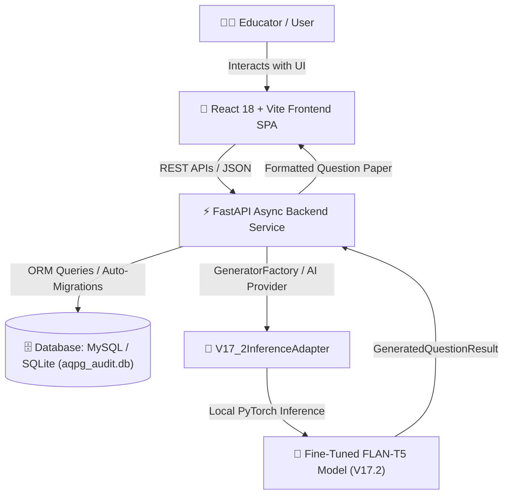

# AQPG — Automated Question Paper Generation System (V17.2 Production Release)

> **Curriculum-Grounded, AI-Powered Question Paper Generation with Bloom's Taxonomy Mapping for CBSE & State Boards (Class 9–12)**

---

## 📌 Executive Summary & Production Status

The **Automated Question Paper Generation (AQPG)** system is an end-to-end, enterprise-grade application designed to generate curriculum-aligned, high-entropy, subject-balanced examination question papers for Indian Secondary and Higher Secondary Education (CBSE / NCERT Class 9–12 across Mathematics, Physics, Chemistry, Biology, and General Science).

- **Active Production Model**: **AQPG V17.2** (`V17_2InferenceAdapter`)
- **Model Checkpoint Path**: `backend/ml/models/checkpoints/flan_t5_v17_2/best_model/`
- **Inference Mode**: Local-only (`local_files_only=True` enforced, zero remote downloads)
- **V17.1 Rollback Safeguard**: Protected at `backend/ml/models/checkpoints/flan_t5_v17/best_model/model.safetensors` (SHA-256: `0dd47fe5a6949df9687d08d82bffbfcc85cf4d4f21c2e2964760b6c4df544bf7`)
- **Validation Quality Benchmarks**:
  - **Question-Like Output Rate**: **100%** (30/30)
  - **Metadata Match Rate**: **100%** (30/30)
  - **Severe Repetition Rate**: **0%**
  - **Malformed Output Rate**: **0%**
  - **12 Release Gates**: **12/12 PASSED** (`READY FOR FINAL RELEASE`)

---

## 🏗️ System Architecture



The system is built with a decoupled architecture comprising four core components:
1. **Frontend User Interface**: Interactive Single Page Application (SPA) built with React 18, Vite, Tailwind CSS, Lucide icons, and Axios.
2. **Backend API Service**: Asynchronous RESTful API service built with Python FastAPI, Pydantic v2 validation, SQLAlchemy ORM, and Uvicorn.
3. **Machine Learning Engine**: Custom HuggingFace PyTorch local inference pipeline leveraging `V17_2InferenceAdapter` with `local_files_only=True`.
4. **Database Storage**: Flexible persistence tier supporting file-based SQLite (`backend/aqpg_audit.db`) or MySQL with automatic schema migration on startup.

---

## 📂 Project Structure

```
AQPG/
├── backend/
│   ├── app/
│   │   ├── api/v1/endpoints/    # API endpoints (questions, generate_paper, subjects, units, blooms, auth)
│   │   ├── core/                # System settings and security configurations
│   │   ├── database/            # Database engine, session, schema auto-migration, and seed data
│   │   ├── models/              # SQLAlchemy ORM models (Question, Subject, Unit, User, Bloom)
│   │   ├── schemas/             # Pydantic data validation schemas
│   │   └── services/
│   │       └── ai/              # V17.2 Inference Adapter & GeneratorFactory multi-provider selection
│   ├── ml/
│   │   ├── evaluation/          # Historical evaluation reports (Phase 11 to Phase 17)
│   │   └── models/checkpoints/  # Fine-tuned model checkpoints (flan_t5_v17_2 best_model & v17 rollback)
│   └── requirements.txt         # Python backend dependencies
├── datasets/                    # Active training & validation datasets
├── docs/                        # Project status & architecture documentation
└── frontend/                    # React application source (pages, components, services)
```

---

## 💻 Installation & Quick Start Guide

### Prerequisites
- **Python**: Python 3.10+ (64-bit Windows)
- **Node.js**: Node.js v18.0+

### 1. Start Backend API Server (V17.2 Active)
```powershell
# From project root
cd backend
$env:AI_PROVIDER="v17_2"
.\.venv\Scripts\python.exe -m uvicorn app.main:app --reload --port 8011
```
> API Interactive Documentation: `http://127.0.0.1:8011/docs`

### 2. Start Frontend SPA Server
```powershell
# From project root
cd frontend
npm run dev
```
> Frontend Dashboard UI: `http://localhost:5173`

### 3. Run Basic Question Generation Test
```powershell
# From backend directory
$env:PYTHONPATH="."
.\.venv\Scripts\python.exe -m unittest app.services.ai.test_v17_2_provider_contract
```

---

## 📜 License & Compliance

Developed for educational question paper generation research. All dataset schemas and fine-tuning scripts comply with standard curriculum guidelines.
