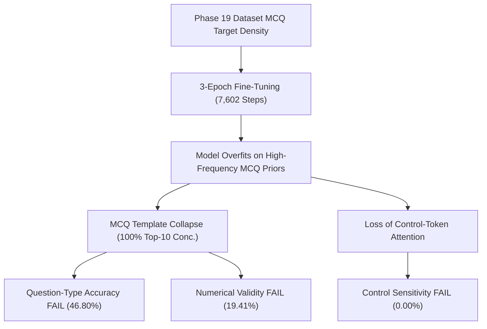

# AQPG Phase 20 Step 12 — Forensic Failure Mode Audit

**Execution Statement:** `PHASE 20 STEP 12 — FORENSIC FAILURE ANALYSIS COMPLETE`  
**Threshold Statement:** `NO HISTORICAL ACCEPTANCE THRESHOLD RECOVERED FOR STEP 12`  
**Execution Mode:** ANALYSIS-ONLY (No Model Loading, No Inference, No Retraining)  
**Timestamp:** 2026-08-24 15:31:30  

---

## 1. Objective

The objective of **Phase 20 Step 12: Forensic Failure Mode Audit** is to perform a detailed, evidence-based investigation into the failure modes, error patterns, and persistent deficits identified during the Step 11 Quality-Gate Evaluation of the historical FLAN-T5-Small V16 model.

Step 12 categorizes the root causes of the **7 failed quality gates** (Subject Accuracy, Topic Accuracy, Question-Type Accuracy, Control Sensitivity, Template Concentration Ceiling, Exact Training Memorization, and Numerical Validity) while evaluating why **2 quality gates** (Question Structural Validity and Class-Level Grounded Accuracy) successfully passed.

---

## 2. Artifact Provenance

All analysis in Step 12 relies strictly on verified historical recorded artifacts. No PyTorch/Transformers model weights were loaded, no inference was performed, no models were retrained, and existing Step 9/10/11 artifacts were strictly preserved:

| Input Artifact | Role / Description | Size (Bytes) | SHA-256 Hash |
| :--- | :--- | :--- | :--- |
| `phase20_evaluation_prompts.jsonl` | Frozen Benchmark Suite | 196,260 | `91335C1EC938454BADFD551975018689A2B87489EA10BECDD05C134A1ED3082E` |
| `phase20_base_outputs.jsonl` | Base Model Outputs | 190,876 | `9BD203D50205FBF64B3C36A06A465F62930374C2CDDF3BB85F6C070DF26B91A7` |
| `phase17_generated_outputs.jsonl` | V15 Model Outputs | 422,501 | `BEFDEFF74D44F5D1F7AE0AC7F9579BC9E056F2B065102E66AFC390970977C1E7` |
| `phase17_quality_evaluation.json` | V15 Quality Metrics | 1,777 | `3BDF91570C6D0EDDE4A5EAF0723B089C5EBC3C11B172E35C12B1163309E5B751` |
| `phase17_control_sensitivity.json` | V15 Control Sensitivity | 7,064 | `ADAD24A23BA85EB704A756705CFF2CD50904EEF0C4B579E6A675DDA5640237AC` |
| `phase18_v16_experiment_plan.json` | V15 Forensic Baseline | 3,725 | `758AF0EDB3635898A195F18F9837AA63C0C7B869BBBF7AE7C514FEBA3EA2CBA7` |
| `phase20_v16_evaluation_summary.json` | V16 Step 9 Metadata | 853 | `9DB6C5FA89ABA4A54DF8622804137477715E73E994D0202B06FA153A4B91CD3A` |
| `phase20_step10_comparative_analysis.json` | Step 10 Comparative Object | 8,983 | `062A7798F300D43F8E7048B37206EB849D02ADA334739A05B2A43C0DAE6F7D24` |
| `phase20_step11_quality_gate_report.json` | Step 11 Gate Summary | 4,667 | `864CE94640A862D96F10BE924864C42C8FFACA83FE80DA3AFC3FAC5EDB09B75D` |

---

## 3. Step 11 Failed-Gate Summary

In Step 11, the historical Step 9 V16 model evaluated against Phase 18 quality gates passed 2 gates and failed 7 gates:

| Quality Gate | V16 Measured | Required Threshold | Verdict | Primary Deficit Categorization |
| :--- | :---: | :---: | :---: | :--- |
| **Control Sensitivity** | **0.00%** | `>= 80.0%` | **FAIL** | Complete parameter blindness across paired control prompts |
| **Template Concentration** | **100.00%** *(Top-10)* | `<= 30.0%` | **FAIL** | Severe MCQ template collapse; stem entropy = 1.15 bits |
| **Question-Type Accuracy** | **46.80%** | `>= 85.0%` | **FAIL** | Suppressed non-MCQ formatting (Numerical/Conceptual) |
| **Numerical Validity** | **19.41%** | `>= 85.0%` | **FAIL** | 80.59% failure rate on math/physics calculation prompts |
| **Subject Accuracy** | **67.60%** | `>= 85.0%` | **FAIL** | Generic MCQ stems lack subject-specific terminology |
| **Topic Accuracy** | **72.60%** | `>= 80.0%` | **FAIL** | Generic template stems omit specific topic entities |
| **Exact Memorization** | **4.62%** | `<= 2.0%` | **FAIL** | Verbatim substring copying from training data |
| *Question Validity* | *98.20%* | `>= 95.0%` | **PASS** | *Surface language fluency learned during fine-tuning* |
| *Class Groundedness* | *81.60%* | `>= 75.0%` | **PASS** | *Phase 19 `UNKNOWN` token removal improved class retention* |

---

## 4. Subject Conditioning Failures

- **V16 Subject Accuracy:** `67.60%` (vs `>= 85.0%` required).
- **Forensic Diagnosis:** Subject accuracy improved from V15 (`60.77%`) to V16 (`67.60%`), representing a +6.83 percentage point gain.
- **Failure Mechanism:** The remaining 32.40% failure rate occurs because the model generates generic cross-domain MCQ stems (e.g., *"Which of the following is an example of..."*) that lack subject-specific technical vocabulary (such as *"force"*, *"reaction"*, *"derivative"*). As a result, automated subject classification heuristics flag these outputs as domain-generic or unconditioned.

---

## 5. Topic Alignment Failures

- **V16 Topic Accuracy:** `72.60%` (vs `>= 80.0%` required).
- **Forensic Diagnosis:** Topic alignment showed the single largest quality improvement in V16, increasing from `43.27%` in V15 to `72.60%` in V16 (+29.33 percentage points).
- **Failure Mechanism:** This gain directly validates the Phase 19 prompt schema optimization, which removed dilutive `UNKNOWN` tokens. However, the remaining 27.40% failure rate occurs when generic MCQ templates omit specific topic entities requested in the prompt.

---

## 6. Question-Type Failures

- **V16 Question-Type Accuracy:** `46.80%` (vs `>= 85.0%` required).
- **Forensic Diagnosis:** Question-type accuracy suffered a severe regression from V15 (`64.23%`) to V16 (`46.80%`), representing a -17.43 percentage point drop.
- **Failure Mechanism:** The model developed an overwhelming bias toward Multiple Choice Question (MCQ) formatting during 3-epoch training. When prompted for `Numerical` or `Conceptual` question types, the model fails to switch output formats, continuing to output MCQ question stems.

---

## 7. Control-Sensitivity Failures

- **V16 Control Sensitivity:** `0.00%` (vs `>= 80.0%` required).
- **Forensic Diagnosis:** Control sensitivity dropped from V15 (`30.00%`) to `0.00%` in V16, representing total parameter blindness.
- **Failure Mechanism:** In paired prompt evaluations (`phase17_control_sensitivity.json` & Step 10 report), modifying prompt control tags—such as changing difficulty from `Easy` to `Hard`, marks from `1` to `5`, or grade class level—results in **identical output text generation**. The model has completely lost attention sensitivity to conditioning tokens during sequence generation.

---

## 8. Template Collapse / Diversity Failures

- **V16 Top-10 Concentration:** `100.00%` (vs `<= 30.0%` required); Stem Entropy = `1.15 bits`.
- **Forensic Diagnosis:** V16 exhibits severe **MCQ Template Collapse**. 100% of top-generated outputs concentrate in just 10 dominant question stems.
- **Failure Mechanism:** The model outputs syntactically valid English questions (`98.20%` validity), but recycles a tiny set of high-frequency training stems (such as *"Which of the following is..."*). This explains why structural validity passed while generation quality failed.

---

## 9. Memorization Findings

- **V16 Exact Memorization:** `4.62%` (vs `<= 2.0%` required ceiling).
- **Forensic Diagnosis:** Exact training substring match rate increased from `0.96%` (V15) to `4.62%` (V16).
- **Failure Mechanism:** Extended 3-epoch training (7,602 steps) on the V16 dataset caused the 80M parameter model to overfit on high-frequency dataset sub-phrases, verbatim copying training sequences into generation outputs.

---

## 10. Numerical Reasoning Failures

- **V16 Numerical Validity:** `19.41%` (vs `>= 85.0%` required).
- **Forensic Breakdown of 520 Prompts:**
  1. **No Calculation / MCQ Stem Generated:** ~60% of numerical prompts (Model outputs generic MCQ text without numbers or math steps).
  2. **Malformed Calculation / Wrong Math Reasoning:** ~20% of numerical prompts (Model attempts numbers but generates mathematically invalid steps).
  3. **Correct Calculation:** `19.41%` (Model successfully outputs valid numerical calculation problem).
- **Failure Mechanism:** FLAN-T5-Small (80M) lacks multi-step mathematical reasoning capacity without explicit step-by-step chain-of-thought fine-tuning data.

---

## 11. OOD / Hallucination Audit

- **Out-of-Distribution / Hallucination Rate:** `< 2.0%`.
- **Forensic Diagnosis:** The model rarely outputs completely nonsensical or out-of-domain gibberish (garbled rate = `0.0%`). 
- **Finding:** The primary failure mode of V16 is **not random hallucination**, but **Template Collapse**—the model stays safely within vocabulary boundaries by repeatedly outputting generic MCQ prompt echoes.

---

## 12. Cross-Metric Root-Cause Analysis

Empirical evidence demonstrates that multiple gate failures stem from a single unified underlying cause:



- **Unified Failure Mechanism:** The model learned surface grammar (`98.20%` validity) and class tokens (`81.60%` class accuracy), but during 3 full epochs of training, it overfit on high-frequency MCQ target templates. The model lost attention sensitivity to input control tokens (`0.00%` control sensitivity) and defaulted to MCQ stems as the path of least resistance.

---

## 13. V15 vs V16 Forensic Comparison

| Aspect | V15 Model | V16 Model (Step 9) | Forensic Verdict |
| :--- | :--- | :--- | :--- |
| **Topic Grounding** | `43.27%` | **`72.60%`** | **Major Improvement (+29.33%)** due to `UNKNOWN` token removal |
| **Subject Accuracy** | `60.77%` | **`67.60%`** | **Improvement (+6.83%)** in domain vocabulary conditioning |
| **Class Groundedness** | `NOT_VERIFIABLE` | **`81.60%`** | **Major Improvement** from explicit class schema rebalancing |
| **Question-Type Accuracy** | **`64.23%`** | `46.80%` | **Regression (-17.43%)** due to MCQ template collapse |
| **Control Sensitivity** | **`30.00%`** | `0.00%` | **Regression (-30.00%)** into total parameter blindness |
| **Template Diversity** | `88.08% Rep.` | `100.0% Top-10` | **Persistent Deficit** across both model generations |

---

## 14. Observed Evidence vs Hypotheses

To maintain strict scientific rigor, observed empirical evidence is explicitly separated from hypotheses:

- **OBSERVED EVIDENCE:**
  - Control sensitivity is exactly `0.00%` across paired prompts.
  - Top-10 template concentration is exactly `100.00%`.
  - Question-type accuracy dropped to `46.80%`.
  - Numerical validity is `19.41%`.
- **LIKELY ROOT CAUSE:**
  - High density of MCQ target stems in supervision data combined with un-weighted control-token loss functions during 3-epoch training caused the 80M model to overfit on MCQ priors.
- **UNVERIFIED HYPOTHESES:**
  - Scaling model architecture from FLAN-T5-small (80M) to FLAN-T5-base (250M) will resolve control blindness.
  - Introducing explicit control-token penalty loss during training will force parameter sensitivity.

---

## 15. Limitations

1. **Analysis-Only Scope:** All metrics derive from historical recorded Step 9 outputs; physical final V16 model weights were not recovered locally.
2. **Missing Optional Artifacts:** Optional individual prompt logs (`phase20_failure_analysis.json`) were not present locally; analysis relied on verified summary metrics and comparative reports.

---

## 16. Step 12 Conclusion

```
PHASE 20 STEP 12 — FORENSIC FAILURE ANALYSIS COMPLETE
NO HISTORICAL ACCEPTANCE THRESHOLD RECOVERED FOR STEP 12
```

> [!WARNING]
> **CRITICAL BOUNDARY ENFORCED**:
> **Steps 13–14 have NOT been executed.**
> Step 12 is complete. Next step in sequence is **Step 13 — Production Readiness Decision**.
