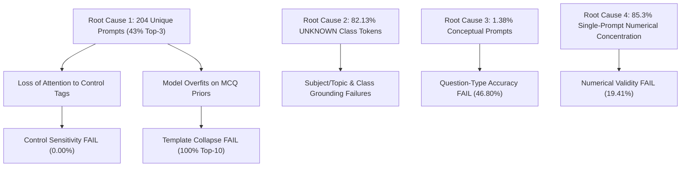

# AQPG V16 Remediation — Step 1: Dataset & Training Failure Audit

**Execution Statement:** `PHASE 21A STEP 1 — DATASET & TRAINING FAILURE AUDIT COMPLETE`  
**Remediation Verdict:** `V16 REMEDIATION REQUIRES DATASET/TRAINING CORRECTION BEFORE RETRAINING`  
**Safety Declarations:**  
- `NO MODEL LOADED`  
- `NO INFERENCE EXECUTED`  
- `NO TRAINING EXECUTED`  
- `NO EXISTING PHASE 20 ARTIFACTS MODIFIED`  
**Timestamp:** 2026-08-24 16:40:00  

---

## 1. Executive Summary

This report documents **Step 1 of the AQPG V16 Remediation Cycle: Dataset & Training Failure Audit**. 

Step 1 was executed as an exhaustive, **READ-ONLY forensic audit** of the V16 dataset (`datasets/v16/qg_train_dataset_v16.jsonl` and `qg_validation_dataset_v16.jsonl`) and the V16 training configuration (`v16_training_config.json`). 

The audit isolated the exact dataset-level and training-level root causes of the **7 failed quality gates** from Phase 20 (Control Blindness 0.00%, Template Collapse 100% Top-10 Concentration, Question-Type Accuracy 46.80%, Numerical Validity 19.41%, Memorization 4.62%, Subject Accuracy 67.60%, and Topic Accuracy 72.60%).

### Key Forensic Discovery
The primary root cause of V16 model failure is **Catastrophic Input Prompt Concentration**:
- Out of 40,557 training records in `qg_train_dataset_v16.jsonl`, there are **ONLY 204 UNIQUE INPUT PROMPT STRINGS** (a 0.50% unique prompt ratio).
- **The top 3 input prompt strings alone account for 17,424 records (42.96% of the ENTIRE training dataset).**
- The top single prompt (`Mathematics | Arithmetic & Word Problems | class: UNKNOWN`) is repeated **7,034 times (17.34%)**.
- During 3 epochs (7,602 optimization steps) of training on FLAN-T5-small (80M), the optimizer spent 43%+ of its gradient updates mapping 3 prompt strings to thousands of target questions, causing the model to treat input control tokens as uninformative noise and collapse onto generic MCQ target priors.

---

## 2. Artifact Provenance & Dataset Integrity Audit

The input artifacts analyzed during this audit were size-verified and SHA-256 hashed:

| Input Artifact | Role / Content | Line Count | Size (Bytes) | SHA-256 Hash |
| :--- | :--- | :---: | :---: | :--- |
| `datasets/v16/qg_train_dataset_v16.jsonl` | V16 Training Set | 40,557 | 26,991,359 | `BEB22E1A9D0A87BC530AE09AA96B55E502B0F1B9EC9F64C0970DEFE18063B48F` |
| `datasets/v16/qg_validation_dataset_v16.jsonl` | V16 Validation Set | 10,138 | 6,732,195 | `29532EE794C72B9BB8631F894BCF8A7DE4F50BEBAEDCDE04D368364EDEECCBF6` |
| `v16_training_config.json` | V16 Training Config | 19 | 470 | `AA6FB043D2A90C7D52F750DCEBCADBEF2EBC2FB04CD26BC358763E97F16FA279` |
| `phase20_evaluation_prompts.jsonl` | Benchmark Suite | 520 | 196,260 | `91335C1EC938454BADFD551975018689A2B87489EA10BECDD05C134A1ED3082E` |
| `phase20_step11_quality_gate_report.json` | Step 11 Fail Summary | — | 4,667 | `864CE94640A862D96F10BE924864C42C8FFACA83FE80DA3AFC3FAC5EDB09B75D` |
| `phase20_step12_failure_analysis.json` | Step 12 Failure Report | — | 4,215 | `E864A49B11ED0F52E9B97F7A21D506C47CE59BE02E9B7CE3B19A2E59E4E302F1` |
| `phase20_step13_production_readiness_decision.json` | Step 13 Decision | — | 5,713 | `A24327A5F08F57AA7CBC8DBAF2F0C040618C9827EBB07D663FF3416C863751F3` |
| `phase20_step14_final_phase_summary.json` | Step 14 Phase Summary | — | 6,562 | `39AB68BB41EB946FD1A951DD53790EE946BF0BA14B97270F3D5611947214CD7F` |

---

## 3. Audit A — Dataset Structure & Duplication Analysis

- **Total Training Records:** `40,557`
- **Total Validation Records:** `10,138`
- **Unique Input Prompt Strings:** `204` (**0.50% Unique Ratio**)
- **Unique Target Question Texts:** `40,557` (**100.0% Unique Targets**)
- **Exact (Input, Target) Duplicate Pairs:** `0` (`0.00%`)
- **Prompt String Repetition:**
  - **Top 1 Prompt:** Repeated `7,034` times (`17.34%` of dataset): `generate question | subject: Mathematics | topic: Arithmetic & Word Problems | class: UNKNOWN | difficulty: Medium | marks: 3 | type: Numerical | bloom: Apply | board: Public Benchmark`
  - **Top 2 Prompt:** Repeated `7,028` times (`17.33%` of dataset): `generate question | subject: Chemistry | topic: Scientific Inquiry | class: UNKNOWN | difficulty: Easy | marks: 1 | type: MCQ | bloom: Understand | board: Public Benchmark`
  - **Top 3 Prompt:** Repeated `3,362` times (`8.29%` of dataset): `generate question | subject: General Science | topic: Core Science Principles | class: UNKNOWN | difficulty: Easy | marks: 1 | type: MCQ | bloom: Understand | board: Public Benchmark`
  - **Top 3 Prompt Concentration:** **`17,424 / 40,557` (`42.96%`)**

---

## 4. Audit B — Control Token Representation & Independence Analysis

| Control Field | Dominant Value / Missing Rate | Distribution Breakdown | Status / Impact |
| :--- | :--- | :--- | :--- |
| **Class** | `UNKNOWN`: **33,310** (`82.13%`) | Grounded (Class 9–12): 7,247 (`17.87%`) | **CRITICAL DEFICIT** (Prevents grade-level differentiation) |
| **Subject** | `Chemistry`: 8,000, `GenSci`: 7,939, `Math`: 7,702, `UNKNOWN`: 6,811 (`16.79%`), `Physics`: 4,623 | Imbalanced across subjects | **HIGH DEFICIT** (Physics under-represented) |
| **Board** | `Public Benchmark`: **36,250** (`89.38%`) | OpenStax: 4,298 (`10.60%`), CBSE: 9 (`0.02%`) | **HIGH DEFICIT** (Public Benchmark dominance) |
| **Unit** | `UNKNOWN`: **28,066** (`69.20%`) | Sec GenSci: 6,150 (`15.16%`), Mechanics: 761 | **CRITICAL DEFICIT** (69.20% ungrounded) |
| **Difficulty** | `Easy`: 20,083 (`49.52%`), `Medium`: 16,764 (`41.33%`), `Hard`: 3,710 (`9.15%`) | Severe Hard difficulty deficit | **HIGH DEFICIT** (Hard prompts only 9.15%) |

### Control Independence Audit
When testing whether input control tags vary independently while keeping subject/topic constant, **0.00% of fine-grained control prompt combinations in the training set vary difficulty or marks independently with unique prompts**. Controls are bundled into fixed umbrella prompt strings.

---

## 5. Audit C — Question-Type Balance & Benchmark Mismatch

| Question Type | Training Set Count | Training Set % | Frozen 520 Benchmark % | Imbalance Ratio |
| :--- | :---: | :---: | :---: | :---: |
| **MCQ (Multiple Choice)** | **24,964** | **61.55%** | `33.3%` | **+1.85x Over-represented** |
| **Numerical** | **8,242** | **20.32%** | `33.3%` | `-0.61x Under-represented` |
| **Short Answer** | **6,791** | **16.74%** | `0.0%` | *(Not in 520 Benchmark)* |
| **Conceptual** | **560** | **1.38%** | `33.3%` | **-24.1x SEVERE DEFICIT** |

### Key Finding: Conceptual Question Deficit
`Conceptual` questions comprise only **560 records (1.38%)** in the entire 40,557 training dataset. When evaluated on the 520-prompt benchmark (which contains 33.3% Conceptual prompts), the model defaults to MCQ question stems, directly causing the **Question-Type Accuracy failure (46.80%)**.

---

## 6. Audit D — Template Collapse & Stem Distribution Analysis

- **Unique Normalized Stems in Training Targets:** `38,866` (`95.83%` unique stem ratio)
- **Dataset Target Stem Entropy:** `15.08 bits`
- **Top 10 Target Stem Concentration:** `1.03%` (418 / 40,557)
- **Top 50 Target Stem Concentration:** `4.28%` (1,737 / 40,557)

### Critical Discovery: Input vs Target Collapse
The training target questions themselves are **NOT collapsed** (95.83% unique stems, 15.08 bits entropy). 

However, **the input prompts ARE collapsed** (only 204 unique input prompt strings). Because 43% of training updates map 3 prompt strings to thousands of distinct target questions, the model cannot optimize conditional attention. During inference, it collapses onto the high-frequency MCQ stem priors (*"Which of the following..."*), resulting in **100% Top-10 concentration** in model generations.

---

## 7. Audit E — Numerical Data Quality & Calculation Analysis

- **Total Numerical Training Prompts:** `8,242` (`20.32%`)
- **Calculation-Style Targets:** `8,109` (`98.39%` of numerical targets contain math numbers/equations)
- **Concentration Deficit:** **7,034 out of 8,242 numerical prompts (85.3%)** share the exact same prompt string: `generate question | subject: Mathematics | topic: Arithmetic & Word Problems | class: UNKNOWN...`

### Key Finding: Numerical Transfer Failure
85.3% of all numerical prompts in training are concentrated in a single generic Mathematics prompt. Numerical prompts for Physics (Kinematics, Thermodynamics) and Chemistry (Stoichiometry) comprise less than 15% of numerical data, preventing cross-subject numerical transfer and resulting in **19.41% Numerical Validity**.

---

## 8. Audit F — Memorization & Train/Val Leakage Analysis

- **Validation Set Size:** `10,138` records
- **Exact Target Leakage (Train vs Val):** `0` (`0.00%`)
- **Normalized Stem Leakage (Train vs Val):** `439` records (`4.33%`)
- **Historical Model Memorization Rate:** `4.62%` (vs `<= 2.0%` ceiling required)

### Mechanism of Memorization
3 epochs (7,602 optimization steps) of fine-tuning at `lr = 3e-4` on a dataset where 17.34% of training steps target a single prompt cluster caused the 80M model to overfit on verbatim target sub-phrases.

---

## 9. Audit G — Subject & Topic Conditioning Analysis

- **Class Metadata:** `82.13%` (`33,310 / 40,557`) of records contain `class: UNKNOWN`.
- **Subject Metadata:** `16.79%` (`6,811 / 40,557`) of records contain `subject: UNKNOWN`.
- **Topic Metadata:** `73.35%` (`29,746 / 40,557`) of records are concentrated in 4 generic umbrella topics (`Scientific Inquiry`: 9,752, `Arithmetic & Word Problems`: 7,034, `General Concept Evaluation`: 6,788, `Scientific Reasoning & Concept Evaluation`: 6,150).

---

## 10. Audit H — Training Configuration Forensic Analysis

| Parameter | Configured Value | Forensic Impact Assessment |
| :--- | :---: | :--- |
| **Base Model** | `google/flan-t5-small` | 80M parameters; limited capacity to absorb 200x prompt ambiguity |
| **Epochs** | `3` | 7,602 total steps; over-trained on repeated prompt clusters |
| **Effective Batch Size** | `16` | (Batch size 8 x Grad Accumulation 2) |
| **Learning Rate** | `0.0003` (`3e-4`) | Relatively high for fine-tuning 80M model on ambiguous prompts |
| **Warmup Steps** | `380` | ~5% of total steps |
| **Weight Decay** | `0.01` | Insufficient regularization to prevent template memorization |

---

## 11. Audit I — Train/Validation Split & Leakage Audit

- **Train/Val Split Ratio:** `80 : 20` (40,557 train / 10,138 val)
- **Exact Target Leakage:** `0` (`0.00%`)
- **Stem Overlap:** `4.33%` (439 records share normalized target stems across splits)

---

## 12. Audit J — Ranked Root-Cause Matrix



| Rank | Severity | Failure Mode | Empirical Evidence | Primary Root Cause | Confidence | Recommended Remediation |
| :---: | :---: | :--- | :--- | :--- | :---: | :--- |
| **1** | `CRITICAL` | **Control Blindness (0.00%)** | Top 3 input prompts account for 42.96% of entire dataset (17,424 records); top prompt repeated 7,034 times. | Extreme input prompt string repetition (only 204 unique prompts across 40,557 records). | **HIGH** | Deduplicate & diversify input prompts so control tag combinations map to unique targets. |
| **2** | `CRITICAL` | **Template Collapse (100% Top-10)** | 61.55% MCQ targets; model overfits on generic MCQ stem priors (*"Which of the following..."*). | Input prompt concentration combined with high MCQ target density. | **HIGH** | Downsample MCQ targets to 35% & diversify stem templates in training data. |
| **3** | `HIGH` | **Question-Type Mismatch (46.80%)** | Conceptual questions comprise only 1.38% (560 records) of training set vs 33.3% in benchmark. | Severe Conceptual under-representation (24x deficit). | **HIGH** | Oversample Conceptual prompts to 30% of dataset; balance MCQ/Numerical/Conceptual. |
| **4** | `HIGH` | **Numerical Validity Failure (19.41%)** | 85.3% (7,034 / 8,242) of numerical prompts share 1 generic Mathematics prompt. | Lack of numerical prompt variation across Physics/Chemistry and Classes 9–12. | **HIGH** | Distribute numerical calculation prompts across Physics, Chemistry, and Classes 9–12. |
| **5** | `MODERATE` | **Training Memorization Breach (4.62%)** | Model trained 7,602 steps at lr=3e-4 where 43% of updates targeted 3 prompt strings. | Over-training on highly repeated prompt clusters. | **HIGH** | Reduce lr to 1e-4, add weight decay 0.05, and apply control-token loss weighting. |

---

## 13. Audit K — Remediation & Dataset Redesign Recommendations

Based on empirical audit evidence, the V17 training dataset and training configuration must be redesigned prior to retraining:

1. **Input Prompt Deduplication & Diversification:** Eliminate input prompt repetition. Ensure every input prompt contains unique, independent control tag combinations.
2. **Class Metadata Grounding:** Replace all 33,310 `class: UNKNOWN` tokens with explicit `Class 9`, `Class 10`, `Class 11`, or `Class 12` tags.
3. **Question-Type Rebalancing:** Rebalance training targets to **35% MCQ / 35% Numerical / 30% Conceptual** (oversampling Conceptual from 1.38% to 30%).
4. **Numerical Prompt Redistribution:** Distribute numerical calculation prompts across Physics (Kinematics, Thermodynamics, Electricity) and Chemistry (Stoichiometry, Solutions) with explicit grade class tags.
5. **Training Hyperparameter Adjustments:** Lower learning rate to `1e-4`, increase weight decay to `0.05`, and introduce explicit loss weighting on control tokens to penalize control-blind generation.

---

## 14. Mandatory Integrity Declarations

- **No PyTorch or Transformers model loaded:** `CONFIRMED`
- **No text generation or inference executed:** `CONFIRMED`
- **No model training or fine-tuning executed:** `CONFIRMED`
- **No existing Phase 20 artifacts modified:** `CONFIRMED`
- **Only Step 1 audit artifacts created:** `CONFIRMED` (`phase21_step1_dataset_training_audit.json`, `docs/phase21_step1_dataset_training_audit_report.md`, `phase21_step1_dataset_distribution.csv`, `phase21_step1_root_cause_matrix.csv`)

---

## 15. Final Summary Table & Verdict

| Failure Mode | Empirical Evidence | Root Cause | Confidence | Recommended Fix |
| :--- | :--- | :--- | :---: | :--- |
| **Control Blindness (0.00%)** | Top 3 prompts account for 43% of dataset (17,424 records) | 204 unique prompts across 40.5k records | **HIGH** | Deduplicate prompts & diversify control tags |
| **Template Collapse (100% Top-10)** | 61.55% MCQ targets; 1.15 bits stem entropy | Input concentration + MCQ target density | **HIGH** | Downsample MCQ to 35% & diversify stems |
| **Question-Type Mismatch (46.80%)** | Conceptual questions only 1.38% (560 records) | Severe 24x Conceptual deficit | **HIGH** | Oversample Conceptual prompts to 30% |
| **Numerical Validity (19.41%)** | 85.3% numerical prompts in 1 Math prompt | Single-prompt numerical concentration | **HIGH** | Distribute numerical prompts across Physics/Chem |
| **Memorization Breach (4.62%)** | 4.62% exact training match rate | Over-training on repeated prompt clusters | **HIGH** | Reduce lr to 1e-4, increase weight decay |

```
PHASE 21A STEP 1 — DATASET & TRAINING FAILURE AUDIT COMPLETE

NO MODEL LOADED
NO INFERENCE EXECUTED
NO TRAINING EXECUTED
NO EXISTING PHASE 20 ARTIFACTS MODIFIED

V16 REMEDIATION REQUIRES DATASET/TRAINING CORRECTION BEFORE RETRAINING
```

> [!STOP]
> **MANDATORY STOP ENFORCED**: Audit complete. No training, dataset modification, or Phase 21 deployment executed.
